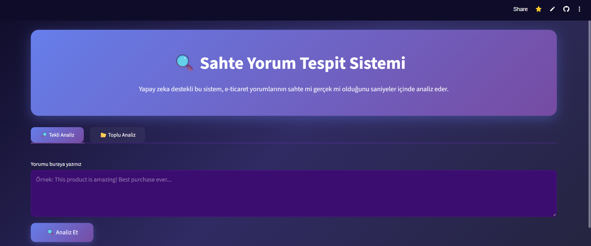
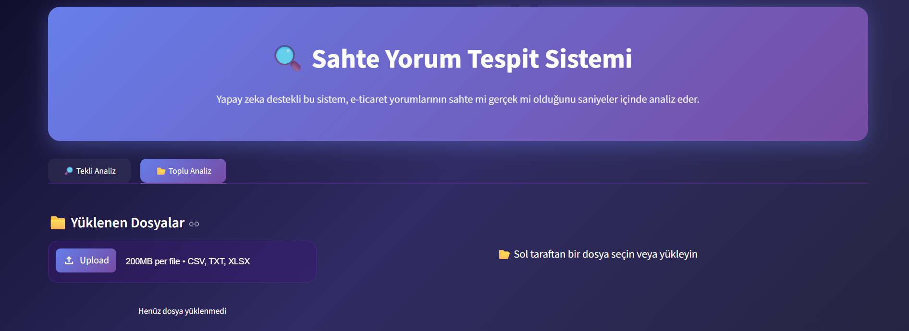

# Fake Review Detection (Sahte Yorum Tespiti)

Bu proje, e-ticaret sitelerindeki kullanıcı yorumlarının gerçekliğini (Gerçek/Sahte) analiz etmek için **Makine Öğrenmesi (Machine Learning)** ve **Doğal Dil İşleme (NLP)** tekniklerini kullanan web tabanlı bir uygulamadır. 

Özellikle yapay zeka tarafından üretilen (Computer Generated) sahte yorumlar ile gerçek kullanıcı deneyimlerini birbirinden ayırmak üzere optimize edilmiştir.

---

## Canlı Demo
Uygulamanın çalışan versiyonuna aşağıdaki bağlantıdan ulaşabilirsiniz:
[https://sahte-yorum-tespiti.streamlit.app/]

---

## 📸 Ekran Görüntüleri

### Tekli Yorum Analizi ve Sonuç Ekranı


### Toplu Analiz ve Grafik Düzeni


## 🎥 Proje Demo Videosu

Uygulamanın canlı kullanımını ve fonksiyonlarını içeren demo videosunu izlemek için [Buraya Tıklayın](https://youtu.be/0v0tjEaT87U).


##  Projenin Amacı
Günümüzde e-ticaret platformlarındaki sahte yorumlar, tüketicileri yanıltmakta ve haksız rekabete yol açmaktadır. Bu projenin geliştirilme amaçları şunlardır:
* **Güvenli Alışveriş:** Kullanıcıların bir yorumun güvenilirliğini saniyeler içinde kontrol etmesini sağlamak.
* **Manipülasyon Engelleme:** İşletmelerin kendi platformlarındaki spam veya botlar tarafından oluşturulmuş içerikleri temizlemesine yardımcı olmak.
* **Akıllı Filtreleme:** Sadece metin değil, anlamlılık kontrolü yaparak anlamsız veri girişlerini önlemek.

---

## Veri Seti ve Model Detayları
Projenin temelini oluşturan makine öğrenmesi süreci şu şekildedir:

* **Veri Seti:** Kaggle üzerindeki "Fake Reviews Dataset" kullanılmıştır. Yaklaşık 40,000 yorum içeren bu veri seti; Ev ve Mutfak, Giysi, Kitap gibi farklı kategorilerden oluşmaktadır.
* **Model Algoritması:** Projede yüksek doğruluk ve hız performansı nedeniyle **SVM (Support Vector Machine)** algoritması tercih edilmiştir.
* **Başarı Oranı (Accuracy):** Yapılan testlerde model **%[91]** başarı oranına ulaşmıştır.
* **Metin İşleme:** Metinler; küçük harfe çevirme, noktalama işaretlerinden arındırma ve **WordNetLemmatizer** ile köklerine ayrılma işlemlerinden geçirilmiştir.

---

##  Kullanılan Teknolojiler
Uygulama geliştirilirken aşağıdaki araç ve kütüphaneler kullanılmıştır:
* **Python 3.10+**: Ana programlama dili.
* **Streamlit**: Web arayüzü tasarımı.
* **Scikit-learn**: Model eğitimi ve TF-IDF vektörleştirme.
* **NLTK**: Doğal dil işleme (Stopwords, Tokenization).
* **Deep Translator**: Çok dilli analiz desteği (Google Translate entegrasyonu).
* **Matplotlib/Numpy**: Veri görselleştirme ve matematiksel işlemler.

---

##  Öne Çıkan Özellikler
1. **Çok Dilli Analiz:** Sistem, Türkçe girilen yorumları otomatik olarak algılar, İngilizceye çevirir ve ardından analiz eder.
2. **Anlamlılık Kontrolü:** "asdasd" gibi rastgele harf dizilerini veya sadece sayılardan oluşan anlamsız girdileri tespit ederek kullanıcıyı uyarır.
3. **Toplu Analiz:** CSV veya Excel dosyası yükleyerek yüzlerce yorum tek seferde analiz edilebilir ve sonuçlar indirilebilir.
4. **Veri Görselleştirme:** Analizlerde gerçek/sahte oranını gösteren grafikler sunar.

---

## Proje Dosya Yapısı

* `app.py`: Streamlit arayüzünü ve uygulamanın tüm mantıksal süreçlerini (frontend/backend) içeren ana dosya.
* `fake_review_detection.ipynb`: Modelin eğitim, test ve analiz süreçlerinin yürütüldüğü Jupyter Notebook dosyası.
* `model.pkl`: Eğitilmiş ve kaydedilmiş SVM model dosyası.
* `tfidf.pkl`: Metinleri modele uygun sayısal formata çeviren vektörleştirici.
* `requirements.txt`: Projenin çalışması için gerekli olan kütüphanelerin listesi.
* `fake_reviews_dataset.csv`: Eğitimde kullanılan ham veri seti.

---

## Yerel Kurulum (Local Setup)

Projeyi kendi bilgisayarınızda çalıştırmak için:

1. **Bu depoyu klonlayın:**

```bash
git clone https://github.com/melunlu/fake-review-detection.git
```

2. **Gerekli kütüphaneleri yükleyin:**

```bash
pip install -r requirements.txt
```

3. **Uygulamayı başlatın:**

```bash
streamlit run app.py
```
